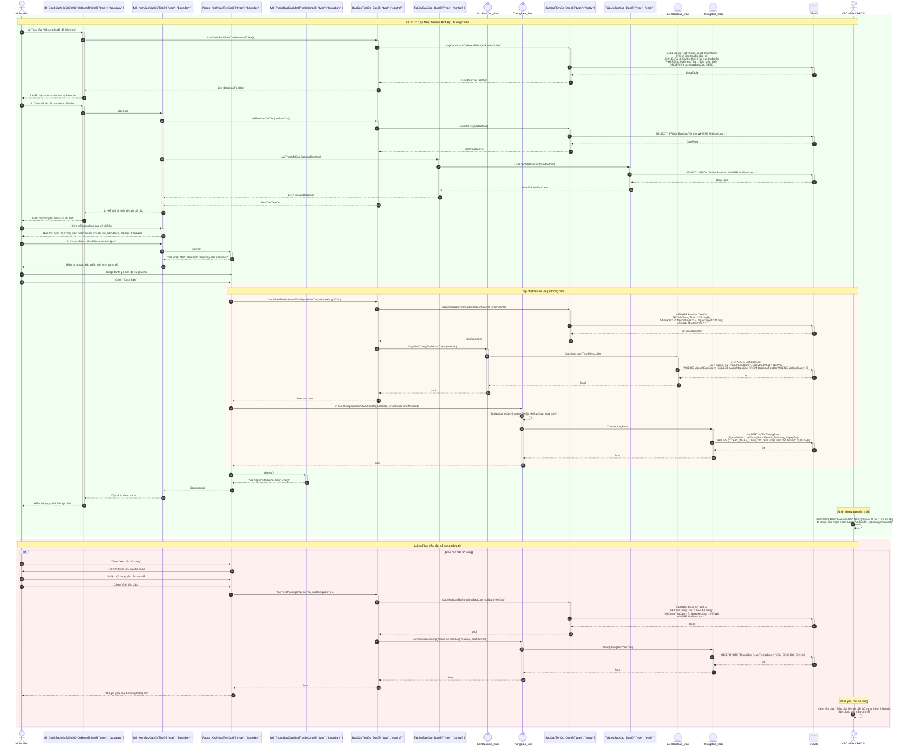

# UC 1.12: Cập Nhật Tiến Độ Định Kỳ - Sequence Diagram

```mermaid
sequenceDiagram
    autonumber
    
    %% Participants definition with proper types
    actor NV as Nhân Viên
    participant UI_DanhSach as Mtl_DanhSachHoSoDinhKyDaHoanThien@{ "type" : "boundary" }
    participant UI_ChiTiet as Mtl_XemBaoCaoChiTiet@{ "type" : "boundary" }
    participant UI_XacNhan as Popup_XacNhanTienDo@{ "type" : "boundary" }
    participant UI_ThongBao as Mtl_ThongBaoCapNhatThanhCong@{ "type" : "boundary" }
    participant BaoCao_Bus as BaoCaoTienDo_Bus@{ "type" : "control" }
    participant TaiLieu_Bus as TaiLieuBaoCao_Bus@{ "type" : "control" }
    participant LichBaoCao_Bus@{ "type" : "control" }
    participant ThongBao_Bus@{ "type" : "control" }
    participant BaoCao_Dao as BaoCaoTienDo_Dao@{ "type" : "entity" }
    participant TaiLieu_Dao as TaiLieuBaoCao_Dao@{ "type" : "entity" }
    participant LichBaoCao_Dao@{ "type" : "entity" }
    participant ThongBao_Dao@{ "type" : "entity" }
    participant DBMS@{ "type" : "database" }
    actor CN as Chủ Nhiệm Đề Tài
    
    %% Main flow
    rect rgb(240, 255, 240)
        Note over NV, CN: UC 1.12: Cập Nhật Tiến Độ Định Kỳ - Luồng Chính
        
        NV->>+UI_DanhSach: 1. Truy cập "Hồ sơ tiến độ đã kiểm tra"
        UI_DanhSach->>+BaoCao_Bus: LayDanhSachBaoCaoDaHoanThien()
        BaoCao_Bus->>+BaoCao_Dao: LayDanhSachDaHoanThien("Đã hoàn thiện")
        BaoCao_Dao->>+DBMS: SELECT bc.*, dt.TenDeTai, dt.ChuNhiem<br/>FROM BaoCaoTienDo bc<br/>JOIN DeTai dt ON bc.MaDeTai = dt.MaDeTai<br/>WHERE bc.MaTrangThai = 'Đã hoàn thiện'<br/>ORDER BY bc.NgayBaoCao DESC
        DBMS-->>-BaoCao_Dao: DataTable
        BaoCao_Dao-->>-BaoCao_Bus: List<BaoCaoTienDo>
        BaoCao_Bus-->>-UI_DanhSach: List<BaoCaoTienDo>
        UI_DanhSach-->>-NV: 2. Hiển thị danh sách theo kỳ báo cáo
        
        NV->>+UI_DanhSach: 3. Chọn đề tài cần cập nhật tiến độ
        UI_DanhSach->>+UI_ChiTiet: opens()
        
        %% Load detailed report information
        UI_ChiTiet->>+BaoCao_Bus: LayBaoCaoChiTiet(maBaoCao)
        BaoCao_Bus->>+BaoCao_Dao: LayChiTiet(maBaoCao)
        BaoCao_Dao->>+DBMS: SELECT * FROM BaoCaoTienDo WHERE MaBaoCao = ?
        DBMS-->>-BaoCao_Dao: DataRow
        BaoCao_Dao-->>-BaoCao_Bus: BaoCaoTienDo
        
        %% Load attached documents
        UI_ChiTiet->>+TaiLieu_Bus: LayTheoMaBaoCao(maBaoCao)
        TaiLieu_Bus->>+TaiLieu_Dao: LayTheoMaBaoCao(maBaoCao)
        TaiLieu_Dao->>+DBMS: SELECT * FROM TaiLieuBaoCao WHERE MaBaoCao = ?
        DBMS-->>-TaiLieu_Dao: DataTable
        TaiLieu_Dao-->>-TaiLieu_Bus: List<TaiLieuBaoCao>
        TaiLieu_Bus-->>-UI_ChiTiet: List<TaiLieuBaoCao>
        
        BaoCao_Bus-->>-UI_ChiTiet: BaoCaoTienDo
        UI_ChiTiet-->>-UI_DanhSach: 4. Hiển thị chi tiết tiến độ đã nộp
        UI_DanhSach-->>NV: Hiển thị thông tin báo cáo chi tiết
        
        NV->>+UI_ChiTiet: Xem nội dung báo cáo và tài liệu
        UI_ChiTiet-->>-NV: Hiển thị: Tóm tắt, Công việc hoàn thành, Thành tựu, Khó khăn, Tài liệu đính kèm
        
        NV->>+UI_ChiTiet: 5. Chọn "Đánh dấu đã hoàn thành kỳ X"
        UI_ChiTiet->>+UI_XacNhan: opens()
        UI_XacNhan-->>-UI_ChiTiet: "Xác nhận đánh dấu hoàn thành kỳ báo cáo này?"
        UI_ChiTiet-->>NV: Hiển thị popup xác nhận với form đánh giá
        
        NV->>UI_XacNhan: Nhập đánh giá tiến độ và ghi chú
        NV->>+UI_XacNhan: Chọn "Xác nhận"
        
        %% Update progress and send notification
        rect rgb(255, 248, 240)
            Note over UI_XacNhan, CN: Cập nhật tiến độ và gửi thông báo
            
            %% Update report status
            UI_XacNhan->>+BaoCao_Bus: XacNhanTienDoHoanThanh(maBaoCao, nhanXet, ghiChu)
            BaoCao_Bus->>+BaoCao_Dao: CapNhatDaDuyet(maBaoCao, nhanXet, nhanVienId)
            BaoCao_Dao->>+DBMS: UPDATE BaoCaoTienDo<br/>SET MaTrangThai = 'Đã duyệt',<br/>    NhanXet = ?, NguoiDuyet = ?, NgayDuyet = NOW()<br/>WHERE MaBaoCao = ?
            DBMS-->>-BaoCao_Dao: int rowsAffected
            BaoCao_Dao-->>-BaoCao_Bus: bool success
            
            %% Update schedule completion
            BaoCao_Bus->>+LichBaoCao_Bus: CapNhatTrangThaiHoanThanh(maLich)
            LichBaoCao_Bus->>+LichBaoCao_Dao: CapNhatHoanThanh(maLich)
            LichBaoCao_Dao->>+DBMS: 6. UPDATE LichBaoCao<br/>SET TrangThai = 'Đã hoàn thành', NgayCapNhat = NOW()<br/>WHERE MaLichBaoCao = (SELECT MaLichBaoCao FROM BaoCaoTienDo WHERE MaBaoCao = ?)
            DBMS-->>-LichBaoCao_Dao: int
            LichBaoCao_Dao-->>-LichBaoCao_Bus: bool
            LichBaoCao_Bus-->>-BaoCao_Bus: bool
            
            BaoCao_Bus-->>-UI_XacNhan: bool success
            
            %% Send confirmation notification
            UI_XacNhan->>+ThongBao_Bus: 7. GuiThongBaoXacNhanTienDo(maDeTai, kyBaoCao, chuNhiemId)
            ThongBao_Bus->>ThongBao_Bus: TaoNoiDungXacNhan(tenDeTai, kyBaoCao, nhanXet)
            ThongBao_Bus->>+ThongBao_Dao: Them(thongBao)
            ThongBao_Dao->>+DBMS: INSERT INTO ThongBao<br/>(NguoiNhan, LoaiThongBao, TieuDe, NoiDung, NgayGui)<br/>VALUES (?, 'XAC_NHAN_TIEN_DO', 'Xác nhận báo cáo tiến độ', ?, NOW())
            DBMS-->>-ThongBao_Dao: int
            ThongBao_Dao-->>-ThongBao_Bus: bool
            ThongBao_Bus-->>-UI_XacNhan: bool
        end
        
        UI_XacNhan->>+UI_ThongBao: shows()
        UI_ThongBao-->>-UI_XacNhan: "Đã cập nhật tiến độ thành công!"
        UI_XacNhan-->>UI_ChiTiet: Đóng popup
        UI_ChiTiet-->>UI_DanhSach: Cập nhật danh sách
        UI_DanhSach-->>-NV: Hiển thị trạng thái đã cập nhật
        
        %% Notification received by project manager  
        Note over CN: Nhận thông báo xác nhận
        activate CN
        CN->>CN: Xem thông báo: "Báo cáo tiến độ kỳ [X] của đề tài '[Tên đề tài]'<br/>đã được xác nhận hoàn thành. Nhận xét: [Nội dung nhận xét]"
        deactivate CN
    end
    
    %% Alternative flow - Require additional information
    rect rgb(255, 240, 240)
        Note over NV, CN: Luồng Phụ: Yêu cầu bổ sung thông tin
        
        alt Báo cáo cần bổ sung
            NV->>UI_XacNhan: Chọn "Yêu cầu bổ sung"
            UI_XacNhan->>NV: Hiển thị form yêu cầu bổ sung
            NV->>UI_XacNhan: Nhập nội dung yêu cầu cụ thể
            NV->>+UI_XacNhan: Chọn "Gửi yêu cầu"
            
            UI_XacNhan->>+BaoCao_Bus: YeuCauBoSung(maBaoCao, noiDungYeuCau)
            BaoCao_Bus->>+BaoCao_Dao: CapNhatCanBoSung(maBaoCao, noiDungYeuCau)
            BaoCao_Dao->>+DBMS: UPDATE BaoCaoTienDo<br/>SET MaTrangThai = 'Cần bổ sung',<br/>    NoiDungYeuCau = ?, NgayYeuCau = NOW()<br/>WHERE MaBaoCao = ?
            DBMS-->>-BaoCao_Dao: bool
            BaoCao_Dao-->>-BaoCao_Bus: bool
            
            BaoCao_Bus->>+ThongBao_Bus: GuiYeuCauBoSung(maDeTai, noiDungYeuCau, chuNhiemId)
            ThongBao_Bus->>+ThongBao_Dao: Them(thongBaoYeuCau)
            ThongBao_Dao->>+DBMS: INSERT INTO ThongBao (LoaiThongBao = 'YEU_CAU_BO_SUNG')
            DBMS-->>-ThongBao_Dao: int
            ThongBao_Dao-->>-ThongBao_Bus: bool
            ThongBao_Bus-->>-BaoCao_Bus: bool
            BaoCao_Bus-->>-UI_XacNhan: bool
            
            UI_XacNhan-->>NV: "Đã gửi yêu cầu bổ sung thông tin"
            
            Note over CN: Nhận yêu cầu bổ sung
            activate CN
            CN->>CN: Xem yêu cầu: "Báo cáo tiến độ cần bổ sung thêm thông tin:<br/>[Nội dung yêu cầu cụ thể]"
            deactivate CN
        end
    end
```
