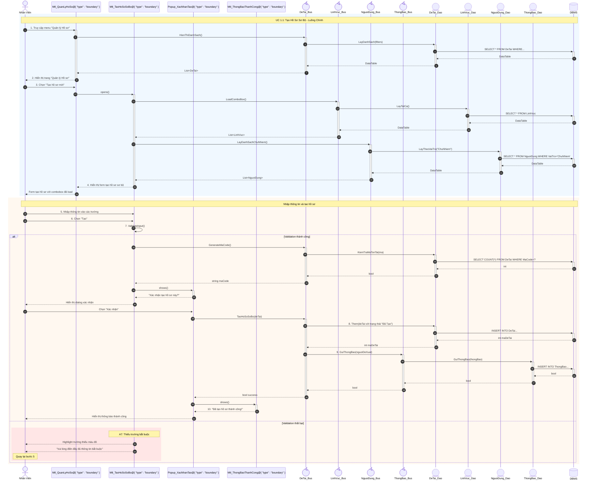

# UC 1.1: Tạo Hồ Sơ Sơ Bộ - Sequence Diagram

```mermaid
sequenceDiagram
    autonumber
    
    %% Participants definition with proper types
    actor NV as Nhân Viên
    participant UI_QuanLy as Mtl_QuanLyHoSo@{ "type" : "boundary" }
    participant UI_TaoHoSo as Mtl_TaoHoSoSoBo@{ "type" : "boundary" }
    participant UI_XacNhan as Popup_XacNhanTao@{ "type" : "boundary" }
    participant UI_ThongBao as Mtl_ThongBaoThanhCong@{ "type" : "boundary" }
    participant DeTai_Bus@{ "type" : "control" }
    participant LinhVuc_Bus@{ "type" : "control" }
    participant NguoiDung_Bus@{ "type" : "control" }
    participant ThongBao_Bus@{ "type" : "control" }
    participant DeTai_Dao@{ "type" : "entity" }
    participant LinhVuc_Dao@{ "type" : "entity" }
    participant NguoiDung_Dao@{ "type" : "entity" }
    participant ThongBao_Dao@{ "type" : "entity" }
    participant DBMS@{ "type" : "database" }
    
    %% Main flow
    rect rgb(240, 248, 255)
        Note over NV, DBMS: UC 1.1: Tạo Hồ Sơ Sơ Bộ - Luồng Chính
        
        NV->>+UI_QuanLy: 1. Truy cập menu "Quản lý Hồ sơ"
        UI_QuanLy->>+DeTai_Bus: HienThiDanhSach()
        DeTai_Bus->>+DeTai_Dao: LayDanhSach(filters)
        DeTai_Dao->>+DBMS: SELECT * FROM DeTai WHERE...
        DBMS-->>-DeTai_Dao: DataTable
        DeTai_Dao-->>-DeTai_Bus: DataTable
        DeTai_Bus-->>-UI_QuanLy: List<DeTai>
        UI_QuanLy-->>-NV: 2. Hiển thị trang "Quản lý Hồ sơ"
        
        NV->>+UI_QuanLy: 3. Chọn "Tạo hồ sơ mới"
        UI_QuanLy->>+UI_TaoHoSo: opens()
        
        %% Load combo boxes
        UI_TaoHoSo->>+LinhVuc_Bus: LoadComboBox()
        LinhVuc_Bus->>+LinhVuc_Dao: LayTatCa()
        LinhVuc_Dao->>+DBMS: SELECT * FROM LinhVuc
        DBMS-->>-LinhVuc_Dao: DataTable
        LinhVuc_Dao-->>-LinhVuc_Bus: DataTable
        LinhVuc_Bus-->>-UI_TaoHoSo: List<LinhVuc>
        
        UI_TaoHoSo->>+NguoiDung_Bus: LayDanhSachChuNhiem()
        NguoiDung_Bus->>+NguoiDung_Dao: LayTheoVaiTro("ChuNhiem")
        NguoiDung_Dao->>+DBMS: SELECT * FROM NguoiDung WHERE VaiTro='ChuNhiem'
        DBMS-->>-NguoiDung_Dao: DataTable
        NguoiDung_Dao-->>-NguoiDung_Bus: DataTable
        NguoiDung_Bus-->>-UI_TaoHoSo: List<NguoiDung>
        
        UI_TaoHoSo-->>-UI_QuanLy: 4. Hiển thị form tạo hồ sơ sơ bộ
        UI_QuanLy-->>NV: Form tạo hồ sơ với combobox đã load
    end
    
    rect rgb(255, 248, 240)
        Note over NV, DBMS: Nhập thông tin và tạo hồ sơ
        
        NV->>UI_TaoHoSo: 5. Nhập thông tin vào các trường
        NV->>+UI_TaoHoSo: 6. Chọn "Tạo"
        
        UI_TaoHoSo->>UI_TaoHoSo: 7. ValidateInput()
        
        alt Validation thành công
            UI_TaoHoSo->>+DeTai_Bus: GenerateMaCode()
            DeTai_Bus->>+DeTai_Dao: KiemTraMaTonTai(ma)
            DeTai_Dao->>+DBMS: SELECT COUNT(*) FROM DeTai WHERE MaCode=?
            DBMS-->>-DeTai_Dao: int
            DeTai_Dao-->>-DeTai_Bus: bool
            DeTai_Bus-->>-UI_TaoHoSo: string maCode
            
            UI_TaoHoSo->>+UI_XacNhan: shows()
            UI_XacNhan-->>-UI_TaoHoSo: "Xác nhận tạo hồ sơ này?"
            UI_TaoHoSo-->>NV: Hiển thị dialog xác nhận
            
            NV->>+UI_XacNhan: Chọn "Xác nhận"
            UI_XacNhan->>+DeTai_Bus: TaoHoSoSoBo(deTai)
            DeTai_Bus->>+DeTai_Dao: 8. Them(deTai với trạng thái "Đã Tạo")
            DeTai_Dao->>+DBMS: INSERT INTO DeTai...
            DBMS-->>-DeTai_Dao: int maDeTai
            DeTai_Dao-->>-DeTai_Bus: int maDeTai
            
            %% Send notification
            DeTai_Bus->>+ThongBao_Bus: 9. GuiThongBao(nguoiDeXuat)
            ThongBao_Bus->>+ThongBao_Dao: GuiThongBao(thongBao)
            ThongBao_Dao->>+DBMS: INSERT INTO ThongBao...
            DBMS-->>-ThongBao_Dao: bool
            ThongBao_Dao-->>-ThongBao_Bus: bool
            ThongBao_Bus-->>-DeTai_Bus: bool
            
            DeTai_Bus-->>-UI_XacNhan: bool success
            UI_XacNhan->>+UI_ThongBao: shows()
            UI_ThongBao-->>-UI_XacNhan: 10. "Đã tạo hồ sơ thành công!"
            UI_XacNhan-->>NV: Hiển thị thông báo thành công
            
        else Validation thất bại
            rect rgb(255, 230, 230)
                Note over UI_TaoHoSo: A7: Thiếu trường bắt buộc
                UI_TaoHoSo-->>NV: Highlight trường thiếu màu đỏ
                UI_TaoHoSo-->>NV: "Vui lòng điền đầy đủ thông tin bắt buộc"
                Note over NV: Quay lại bước 5
            end
        end
    end
```
