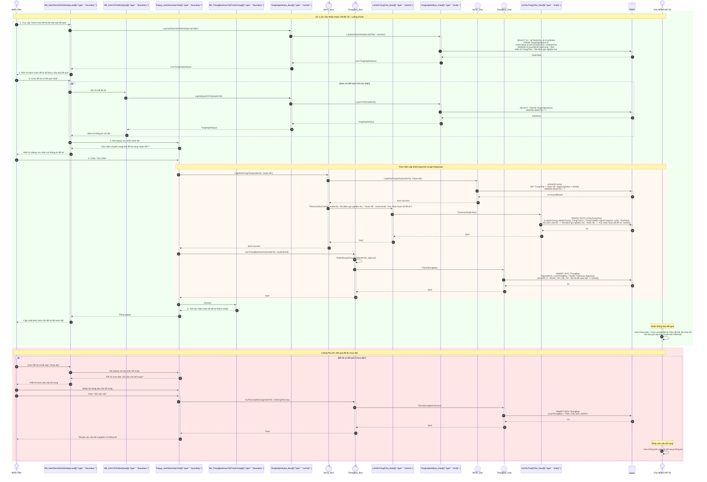

# UC 1.20: Xác Nhận Hoàn Tất Đề Tài - Sequence Diagram

```mermaid
sequenceDiagram
    autonumber
    
    %% Participants definition with proper types
    actor NV as Nhân Viên
    participant UI_DanhSach as Mtl_DanhSachDeTaiDaXepLoai@{ "type" : "boundary" }
    participant UI_ChiTiet as Mtl_XemChiTietKetQua@{ "type" : "boundary" }
    participant UI_XacNhan as Popup_XacNhanHoanTat@{ "type" : "boundary" }
    participant UI_ThongBao as Mtl_ThongBaoHoanTatThanhCong@{ "type" : "boundary" }
    participant TongHop_Bus as TongHopKetQua_Bus@{ "type" : "control" }
    participant DeTai_Bus@{ "type" : "control" }
    participant ThongBao_Bus@{ "type" : "control" }
    participant LichSu_Bus as LichSuTrangThai_Bus@{ "type" : "control" }
    participant TongHop_Dao as TongHopKetQua_Dao@{ "type" : "entity" }
    participant DeTai_Dao@{ "type" : "entity" }
    participant ThongBao_Dao@{ "type" : "entity" }
    participant LichSu_Dao as LichSuTrangThai_Dao@{ "type" : "entity" }
    participant DBMS@{ "type" : "database" }
    actor CN as Chủ Nhiệm Đề Tài
    
    %% Main flow
    rect rgb(240, 255, 240)
        Note over NV, CN: UC 1.20: Xác Nhận Hoàn Tất Đề Tài - Luồng Chính
        
        NV->>+UI_DanhSach: 1. Truy cập "Danh sách đề tài đã xếp loại kết quả"
        UI_DanhSach->>+TongHop_Bus: LayDanhSachDeTaiDaXepLoai("Đạt")
        TongHop_Bus->>+TongHop_Dao: LayDanhSachDaXepLoai("Đạt", namHoc)
        TongHop_Dao->>+DBMS: SELECT th.*, dt.TenDeTai, dt.ChuNhiem<br/>FROM TongHopKetQua th<br/>JOIN DeTai dt ON th.MaDeTai = dt.MaDeTai<br/>WHERE th.QuyetDinhCuoiCung = 'Đạt'<br/>AND dt.TrangThai = 'Đã đánh giá nghiệm thu'
        DBMS-->>-TongHop_Dao: DataTable
        TongHop_Dao-->>-TongHop_Bus: List<TongHopKetQua>
        TongHop_Bus-->>-UI_DanhSach: List<TongHopKetQua>
        UI_DanhSach-->>-NV: 2. Hiển thị danh sách đề tài đã được xếp loại kết quả
        
        NV->>+UI_DanhSach: 3. Chọn đề tài có kết quả "Đạt"
        
        opt Xem chi tiết trước khi xác nhận
            UI_DanhSach->>+UI_ChiTiet: Mở chi tiết đề tài
            UI_ChiTiet->>+TongHop_Bus: LayKetQuaChiTiet(maDeTai)
            TongHop_Bus->>+TongHop_Dao: LayChiTiet(maDeTai)
            TongHop_Dao->>+DBMS: SELECT * FROM TongHopKetQua<br/>WHERE MaDeTai = ?
            DBMS-->>-TongHop_Dao: DataRow
            TongHop_Dao-->>-TongHop_Bus: TongHopKetQua
            TongHop_Bus-->>-UI_ChiTiet: TongHopKetQua
            UI_ChiTiet-->>UI_DanhSach: Hiển thị thông tin chi tiết
        end
        
        UI_DanhSach->>+UI_XacNhan: 4. Mở popup xác nhận hoàn tất
        UI_XacNhan-->>-UI_DanhSach: "Xác nhận chuyển trạng thái đề tài sang 'Hoàn tất'?"
        UI_DanhSach-->>NV: Hiển thị dialog xác nhận với thông tin đề tài
        
        NV->>+UI_XacNhan: 5. Chọn "Xác nhận"
        
        %% Transaction begins
        rect rgb(255, 248, 240)
            Note over UI_XacNhan, CN: Thực hiện cập nhật trạng thái và gửi thông báo
            
            %% Update project status
            UI_XacNhan->>+DeTai_Bus: CapNhatTrangThai(maDeTai, "Hoàn tất")
            DeTai_Bus->>+DeTai_Dao: CapNhatTrangThai(maDeTai, "Hoàn tất")
            DeTai_Dao->>+DBMS: UPDATE DeTai<br/>SET TrangThai = 'Hoàn tất', NgayCapNhat = NOW()<br/>WHERE MaDeTai = ?
            DBMS-->>-DeTai_Dao: int rowsAffected
            DeTai_Dao-->>-DeTai_Bus: bool success
            
            %% Log status change
            DeTai_Bus->>+LichSu_Bus: ThemLichSu("DeTai", maDeTai, "Đã đánh giá nghiệm thu", "Hoàn tất", nhanVienId, "Xác nhận hoàn tất đề tài")
            LichSu_Bus->>+LichSu_Dao: ThemLichSu(lichSu)
            LichSu_Dao->>+DBMS: INSERT INTO LichSuTrangThai<br/>(LoaiDoiTuong, MaDoiTuong, TrangThaiCu, TrangThaiMoi, NguoiThayDoi, LyDo, ThoiGian)<br/>VALUES ('DeTai', ?, 'Đã đánh giá nghiệm thu', 'Hoàn tất', ?, 'Xác nhận hoàn tất đề tài', NOW())
            DBMS-->>-LichSu_Dao: int
            LichSu_Dao-->>-LichSu_Bus: bool
            LichSu_Bus-->>-DeTai_Bus: bool
            
            DeTai_Bus-->>-UI_XacNhan: bool success
            
            %% Send notification to project manager
            UI_XacNhan->>+ThongBao_Bus: GuiThongBaoHoanTat(maDeTai, chuNhiemId)
            ThongBao_Bus->>ThongBao_Bus: TaoNoiDungThongBao(tenDeTai, xepLoai)
            ThongBao_Bus->>+ThongBao_Dao: Them(thongBao)
            ThongBao_Dao->>+DBMS: INSERT INTO ThongBao<br/>(NguoiNhan, LoaiThongBao, TieuDe, NoiDung, NgayGui)<br/>VALUES (?, 'HOAN_TAT_DE_TAI', 'Đề tài đã hoàn tất', ?, NOW())
            DBMS-->>-ThongBao_Dao: int
            ThongBao_Dao-->>-ThongBao_Bus: bool
            ThongBao_Bus-->>-UI_XacNhan: bool
        end
        
        UI_XacNhan->>+UI_ThongBao: shows()
        UI_ThongBao-->>-UI_XacNhan: 6. "Đã xác nhận hoàn tất đề tài thành công!"
        UI_XacNhan-->>UI_DanhSach: Đóng popup
        UI_DanhSach-->>-NV: Cập nhật danh sách (ẩn đề tài đã hoàn tất)
        
        %% Notification received by project manager
        Note over CN: Nhận thông báo kết quả
        activate CN
        CN->>CN: Xem thông báo: "Chúc mừng! Đề tài '[Tên đề tài]' đã hoàn tất<br/>với kết quả xếp loại: [Xuất sắc/Tốt/Khá]"
        deactivate CN
    end
    
    %% Alternative flow - Project not passed
    rect rgb(255, 230, 230)
        Note over NV, CN: Luồng Phụ A4: Kết quả đề tài chưa đạt
        
        alt Đề tài có kết quả "Chưa đạt"
            NV->>UI_DanhSach: Chọn đề tài có kết quả "Chưa đạt"
            UI_DanhSach->>+UI_XacNhan: Mở popup với tùy chọn bổ sung
            UI_XacNhan-->>-UI_DanhSach: "Đề tài chưa đạt. Gửi yêu cầu bổ sung?"
            UI_DanhSach-->>NV: Hiển thị form yêu cầu bổ sung
            
            NV->>UI_XacNhan: Nhập nội dung yêu cầu bổ sung
            NV->>+UI_XacNhan: Chọn "Gửi yêu cầu"
            
            UI_XacNhan->>+ThongBao_Bus: GuiYeuCauBoSung(maDeTai, noiDungYeuCau)
            ThongBao_Bus->>+ThongBao_Dao: Them(thongBaoYeuCau)
            ThongBao_Dao->>+DBMS: INSERT INTO ThongBao<br/>(LoaiThongBao = 'YEU_CAU_BO_SUNG')
            DBMS-->>-ThongBao_Dao: int
            ThongBao_Dao-->>-ThongBao_Bus: bool
            ThongBao_Bus-->>-UI_XacNhan: bool
            
            UI_XacNhan-->>-NV: "Đã gửi yêu cầu bổ sung/làm rõ thông tin"
            
            Note over CN: Nhận yêu cầu bổ sung
            activate CN
            CN->>CN: Xem thông báo yêu cầu bổ sung thông tin
            deactivate CN
        end
    end
```
