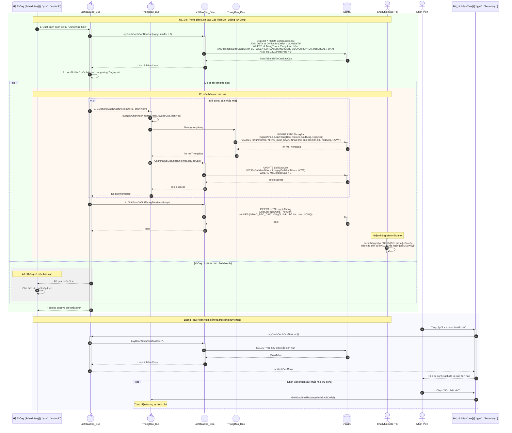

# UC 1.9: Thông Báo Lịch Báo Cáo Tiến Độ - Sequence Diagram

```mermaid
sequenceDiagram
    autonumber
    
    %% Participants definition with proper types
    participant System as Hệ Thống (Scheduler)@{ "type" : "control" }
    participant LichBaoCao_Bus@{ "type" : "control" }
    participant ThongBao_Bus@{ "type" : "control" }
    participant LichBaoCao_Dao@{ "type" : "entity" }
    participant ThongBao_Dao@{ "type" : "entity" }
    participant DBMS@{ "type" : "database" }
    actor CN as Chủ Nhiệm Đề Tài
    
    %% Main flow - Automated process
    rect rgb(240, 255, 240)
        Note over System, CN: UC 1.9: Thông Báo Lịch Báo Cáo Tiến Độ - Luồng Tự Động
        
        System->>+LichBaoCao_Bus: 1. Quét danh sách đề tài "Đang thực hiện"
        LichBaoCao_Bus->>+LichBaoCao_Dao: LayDanhSachCanBaoCao(ngayHienTai + 7)
        LichBaoCao_Dao->>+DBMS: SELECT * FROM LichBaoCao lbc<br/>JOIN DeTai dt ON lbc.MaDeTai = dt.MaDeTai<br/>WHERE dt.TrangThai = 'Đang thực hiện'<br/>AND lbc.NgayBaoCaoDuKien BETWEEN CURDATE() AND DATE_ADD(CURDATE(), INTERVAL 7 DAY)<br/>AND lbc.DaGuiNhacNho = 0
        DBMS-->>-LichBaoCao_Dao: DataTable deTaiCanBaoCao
        LichBaoCao_Dao-->>-LichBaoCao_Bus: List<LichBaoCao>
        
        LichBaoCao_Bus->>LichBaoCao_Bus: 2. Lọc đề tài có mốc báo cáo trong vòng 7 ngày tới
        
        alt Có đề tài cần báo cáo
            rect rgb(255, 248, 240)
                Note over System, CN: Có mốc báo cáo sắp tới
                
                loop Mỗi đề tài cần nhắc nhở
                    LichBaoCao_Bus->>+ThongBao_Bus: 3. GuiThongBaoNhacNho(maDeTai, chuNhiem)
                    
                    %% Create notification content
                    ThongBao_Bus->>ThongBao_Bus: TaoNoiDungNhacNho(tenDeTai, kyBaoCao, hanNop)
                    
                    %% Save notification to database
                    ThongBao_Bus->>+ThongBao_Dao: Them(thongBao)
                    ThongBao_Dao->>+DBMS: INSERT INTO ThongBao<br/>(NguoiNhan, LoaiThongBao, TieuDe, NoiDung, NgayGui)<br/>VALUES (chuNhiemId, 'NHAC_BAO_CAO', 'Nhắc nhở báo cáo tiến độ', noiDung, NOW())
                    DBMS-->>-ThongBao_Dao: int maThongBao
                    ThongBao_Dao-->>-ThongBao_Bus: int maThongBao
                    
                    %% Update reminder flag
                    ThongBao_Bus->>+LichBaoCao_Dao: CapNhatDaGuiNhacNho(maLichBaoCao)
                    LichBaoCao_Dao->>+DBMS: UPDATE LichBaoCao<br/>SET DaGuiNhacNho = 1, NgayGuiNhacNho = NOW()<br/>WHERE MaLichBaoCao = ?
                    DBMS-->>-LichBaoCao_Dao: bool success
                    LichBaoCao_Dao-->>-ThongBao_Bus: bool success
                    
                    ThongBao_Bus-->>-LichBaoCao_Bus: Đã gửi thông báo
                end
                
                LichBaoCao_Bus->>+LichBaoCao_Dao: 4. GhiNhanDaGuiThongBao(timestamp)
                LichBaoCao_Dao->>+DBMS: INSERT INTO LogHeThong<br/>(LoaiLog, NoiDung, ThoiGian)<br/>VALUES ('NHAC_BAO_CAO', 'Đã gửi nhắc nhở báo cáo', NOW())
                DBMS-->>-LichBaoCao_Dao: bool
                LichBaoCao_Dao-->>-LichBaoCao_Bus: bool
                
                %% Notification received by project manager
                Note over CN: Nhận thông báo nhắc nhở
                activate CN
                CN->>CN: Xem thông báo: "Đề tài [Tên đề tài] cần nộp<br/>báo cáo tiến độ kỳ [X] trước ngày [dd/MM/yyyy]"
                deactivate CN
            end
            
        else Không có đề tài nào cần báo cáo
            rect rgb(240, 240, 240)
                Note over System: A2: Không có mốc báo cáo
                LichBaoCao_Bus-->>System: Bỏ qua bước 3, 4
                System->>System: Chờ đến lần quét tiếp theo
            end
        end
        
        LichBaoCao_Bus-->>-System: Hoàn tất quét và gửi nhắc nhở
    end
    
    %% Optional: Manual check by staff
    rect rgb(248, 248, 255)
        Note over System, CN: Luồng Phụ: Nhân viên kiểm tra thủ công (tùy chọn)
        
        actor NV as Nhân Viên
        participant UI_LichBaoCao as Mtl_LichBaoCao@{ "type" : "boundary" }
        
        NV->>+UI_LichBaoCao: Truy cập "Lịch báo cáo tiến độ"
        UI_LichBaoCao->>+LichBaoCao_Bus: LayDanhSachSapDenHan()
        LichBaoCao_Bus->>+LichBaoCao_Dao: LayDanhSachCanBaoCao(7)
        LichBaoCao_Dao->>+DBMS: SELECT với điều kiện sắp đến hạn
        DBMS-->>-LichBaoCao_Dao: DataTable
        LichBaoCao_Dao-->>-LichBaoCao_Bus: List<LichBaoCao>
        LichBaoCao_Bus-->>-UI_LichBaoCao: List<LichBaoCao>
        UI_LichBaoCao-->>-NV: Hiển thị danh sách đề tài sắp đến hạn
        
        opt Nhân viên muốn gửi nhắc nhở thủ công
            NV->>+UI_LichBaoCao: Chọn "Gửi nhắc nhở"
            UI_LichBaoCao->>ThongBao_Bus: GuiNhacNhoThucong(danhSachDeTai)
            Note over ThongBao_Bus: Thực hiện tương tự bước 3-4
        end
    end
```
